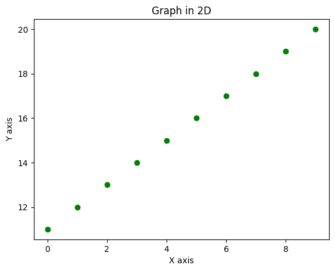
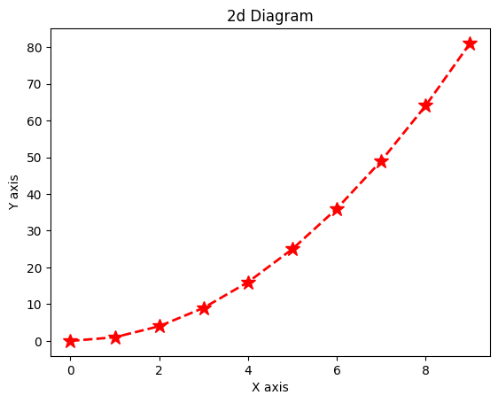
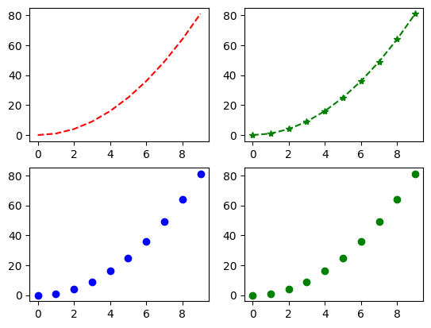
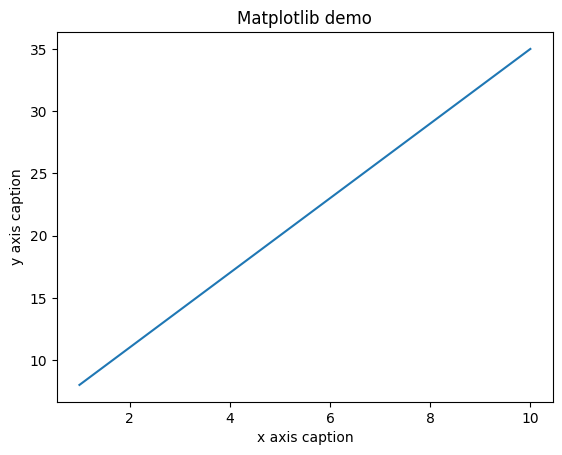
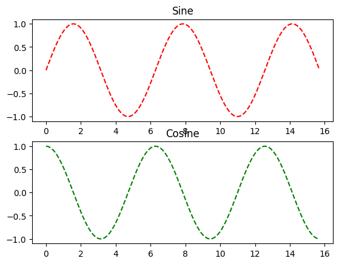
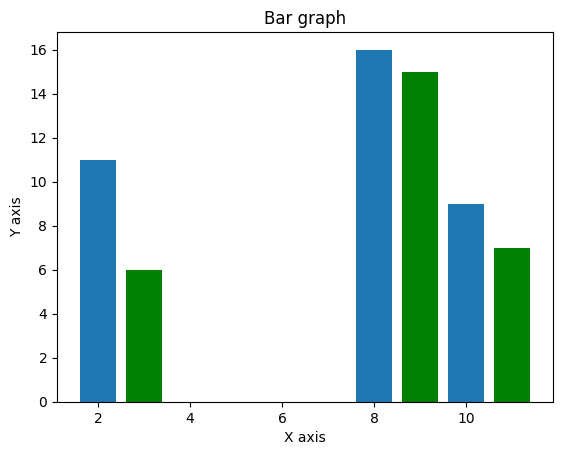
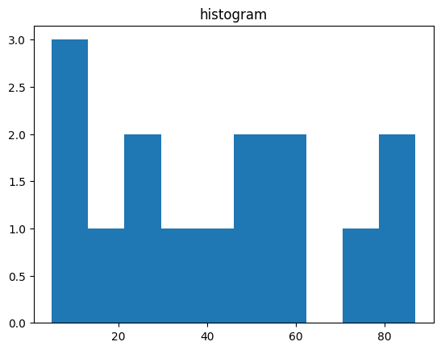
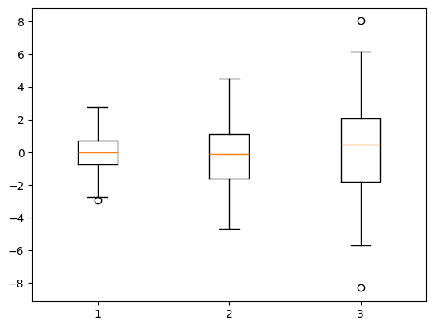
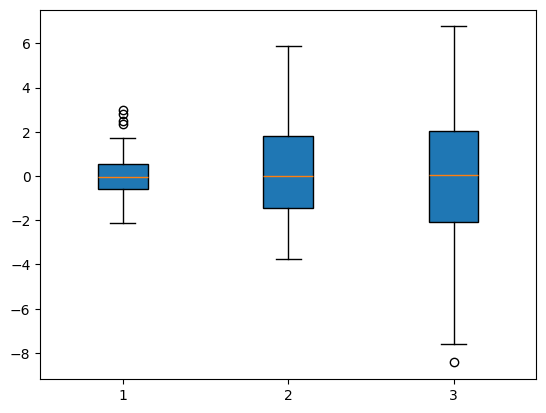
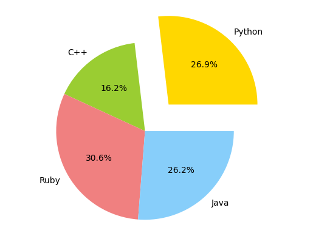

# EXNO-5-DS-DATA VISUALIZATION USING MATPLOT LIBRARY

# Aim:
  To Perform Data Visualization using matplot python library for the given datas.

# EXPLANATION:
Data visualization is the graphical representation of information and data. By using visual elements like charts, graphs, and maps, data visualization tools provide an accessible way to see and understand trends, outliers, and patterns in data.

# Algorithm:
STEP 1:Include the necessary Library.

STEP 2:Read the given Data.

STEP 3:Apply data visualization techniques to identify the patterns of the data.

STEP 4:Apply the various data visualization tools wherever necessary.

STEP 5:Include Necessary parameters in each functions.

# Coding and Output:
 ```
 import matplotlib.pyplot as plt

%matplotlib inline

import numpy as np

x=np.arange(0,10) y=np.arange(11,21)

plt.scatter(x,y,c='g') 
plt.xlabel('X axis') 
plt.ylabel('Y axis')
 plt.title('Graph in 2D') 
plt.savefig('Test.png')
```



```
plt.plot(x,y,'r*',linestyle='dashed',linewidth=2, markersize=12) 
plt.xlabel('X axis')
 plt.ylabel('Y axis')
  plt.title('2d Diagram')
 plt.show()
```



```
plt.subplot(2,2,1)
 plt.plot(x,y,'r--') 
plt.subplot(2,2,2)
 plt.plot(x,y,'g*--')
 plt.subplot(2,2,3) 
plt.plot(x,y,'bo') plt.subplot(2,2,4) 
plt.plot(x,y,'go')
 plt.show()
```


```
x = np.arange(1,11) y = 3 * x + 5
 plt.title("Matplotlib demo")
 plt.xlabel("x axis caption") 
 plt.ylabel("y axis caption") 
plt.plot(x,y) 
plt.show()
```


Compute the x and y coordinates for points on a sine curve

```
x = np.arange(0, 4 * np.pi, 0.1) 
y = np.sin(x) 
plt.title("sine wave form")
```
Plot the points using matplotlib

```
plt.plot(x, y)
plt.show()
```

```
x = np.arange(0, 5 * np.pi, 0.1) y_sin = np.sin(x) y_cos = np.cos(x)

plt.subplot(2, 1, 1)

plt.plot(x, y_sin,'r--')
 plt.title('Sine')

plt.subplot(2, 1, 2)
 plt.plot(x, y_cos,'g--') 
 plt.title('Cosine')

plt.show()
```


Bar plot
```
x = [2,8,10] y = [11,16,9]

x2 = [3,9,11] y2 = [6,15,7] plt.bar(x, y) plt.bar(x2, y2, color = 'g') p
lt.title('Bar graph') p
lt.ylabel('Y axis') 
plt.xlabel('X axis')

plt.show()
```


Histogram

```
a = np.array([22,87,5,43,56,73,55,54,11,20,51,5,79,31,27]) 
plt.hist(a) 
plt.title("histogram") 
plt.show()
```



```
data = [np.random.normal(0, std, 100) for std in range(1, 4)]
```

rectangular box plot
```
plt.boxplot(data,vert=True,patch_artist=False);
plt.show()
```




```
data = [np.random.normal(0, std, 100) for std in range(1, 4)]
```
rectangular box plot
```
plt.boxplot(data,vert=True,patch_artist=True); 

plt.show()
```


```

labels = 'Python', 'C++', 'Ruby', 'Java' sizes = [215, 130, 245, 210] colors = ['gold', 'yellowgreen', 'lightcoral', 'lightskyblue'] explode = (0.4, 0, 0, 0) # explode 1st slice


plt.pie(sizes, explode=explode, labels=labels, colors=colors, autopct='%1.1f%%', shadow=False)

plt.axis('equal') plt.show()
```



# Result:
Thus we performed Data Visualization using matplot python library for the given datas.


